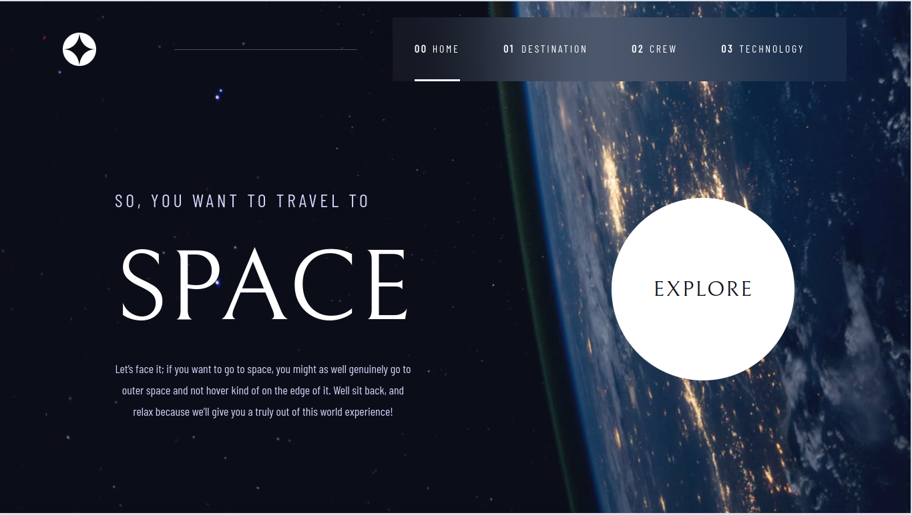

<h1 align="center"> Projeto Space Tourism Multi Page Website </h1>

<i>Status do Projeto</i>: <b>Concluido</b>
 
    
## Funcionalidades

- **Página de destino (Destination)**
  - [x] Visualizar todas os destinos disponíveis;

- **Página da equipe (Crew)**
  - [x] Conhecer sobre os membros da equipe;

- **Página de tecnologia (Technology)**
  - [x] Saber mais sobre a parte tecnologica;

- **Extras**
  - [x] Responsividade para dispositivos móveis e desktops;

## Deploy da Aplicação na vercel

> https://fm-space-tourism-multi-page-website.vercel.app/

## Como rodar a aplicação:

1. No terminal, clone o projeto:

   > git clone https://github.com/matheusmantini/fm-space-tourism-multi-page-website.git

2. Entre na pasta do projeto:

   > cd fm-space-tourism-multi-page-website

3. Instale as dependências:

   > npm install

4. Execute a aplicação:

   > npm run start

5. Pronto, agora é possível acessar a aplicação a partir da rota http://localhost:3000/

## Screenshots

## Desenvolvedor

| [    Matheus Mantini ](https://www.linkedin.com/in/matheusmantini/) |
| :------------------------------------------------------------------------------------------------------------------------------------------------: |
